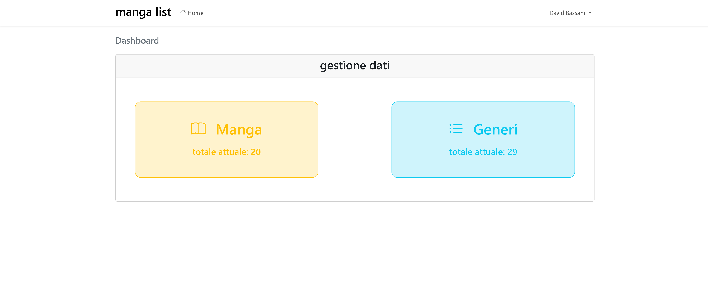
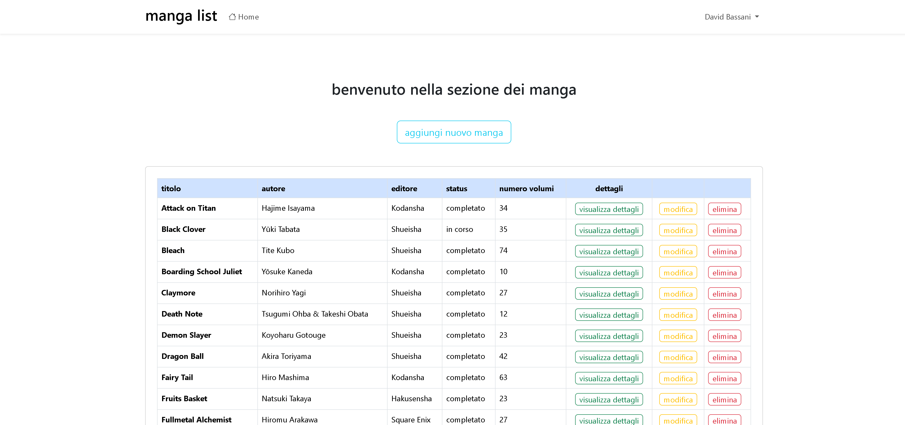
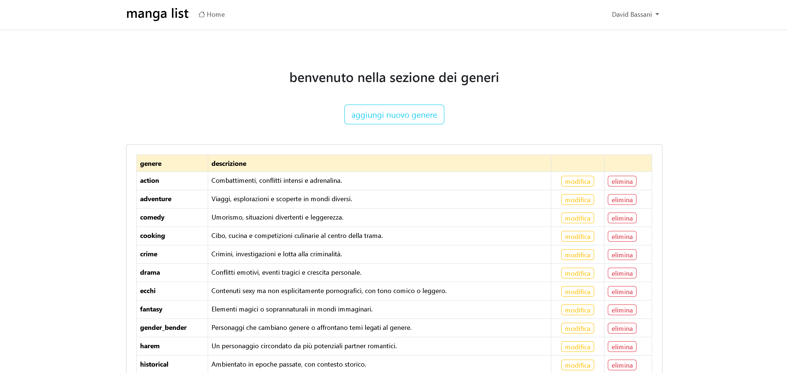
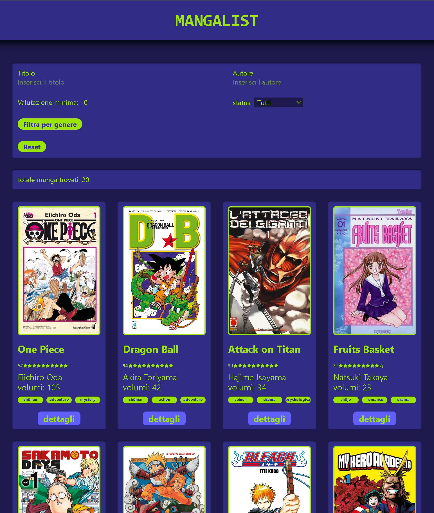
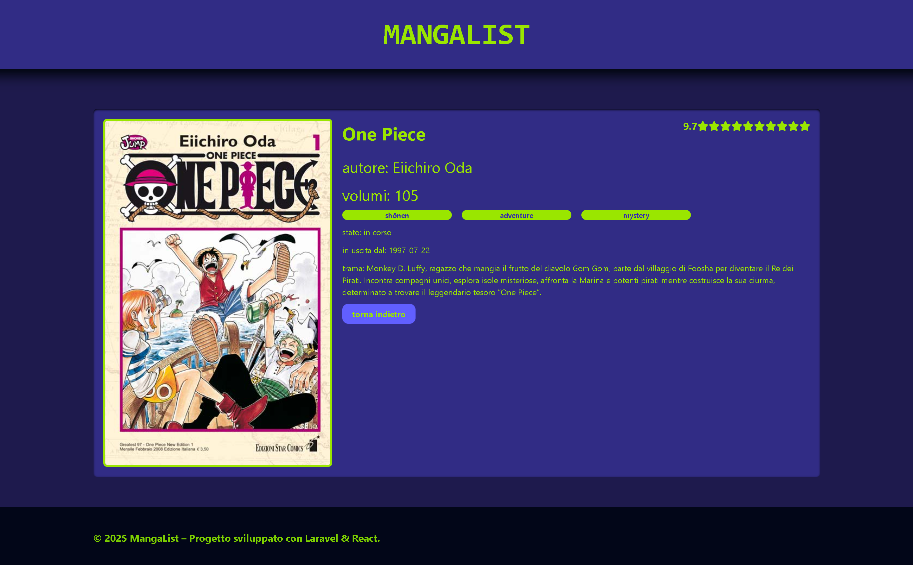

# Progetto Finale per la specialistica di PHP e Laravel

## Obiettivo: creare un backoffice in Laravel e un frontend in React per gestire e visualizzare un insieme di dati relativi ai manga.

### Parte 1: backoffice con autenticazione gestita da Laravel Breeze

#### Funzionalità implementate:

- Dashboard iniziale (pagina di benvenuto con link per gestione manga e generi)
- Autenticazione utente (registrazione, login e logout, middleware auth per proteggere tutte le rotte del backoffice)
- Gestione Manga (CRUD e relazione N:N con genere)
- Gestione Genere (CRUD)
- set di endpoint API per recuperare i dati

### Parte 2: Sito guest in React

#### Funzionalità implementate:

- Visualizzare la lista dei manga in modo chiaro e interattivo
- Vedere i dettagli di un singolo elemento mostrando anche le informazioni collegate
- comunicare con il backend tramite chiamate AJAX ad API REST

### Tecnologie utilizzate

| Tecnologia     | Utilizzo                                 |
| -------------- | ---------------------------------------- |
| Laravel 12     | Backend, API REST, Blade                 |
| Laravel Breeze | Autenticazione                           |
| MySQL          | Database relazionale                     |
| React          | Frontend pubblico                        |
| Vite           | Build tool sia per laravel che per React |
| Axios          | Chiamate API                             |
| bootstrap      | layout backoffice                        |
| tailwind       | layout sito guest                        |

### screenshot backoffice

### screenshot guest

Realizzato da: Bassani David  
Progetto finale della specializzazione PHP di Boolean
